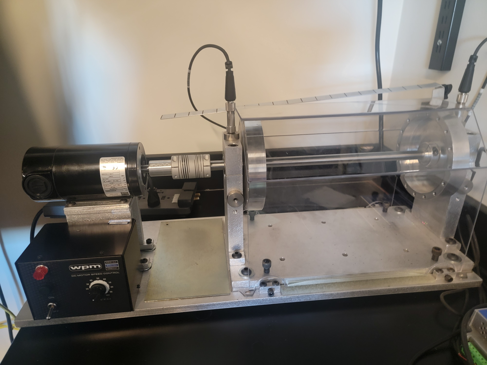

# Bently Nevada System1 Motor Monitoring Data

## Overview

This directory contains vibration and condition monitoring data collected from a motor test bed using **Bently Nevada System1** monitoring software. The data captures the motor's behavior in both baseline (healthy) and faulty operational states, enabling the development and validation of predictive maintenance and fault detection models.

## Equipment and Monitoring Setup



- **Motor**: Test bed motor monitored via two accelerometer channels
- **Software Platform**: Bently Nevada System1
- **Monitoring Channels**: 2 channels (Channel 1 and Channel 2)
- **Measurement Parameters Per Channel**:
  - Bias (DC offset)
  - Derived Peak (peak envelope analysis)
   - Direct (peak acceleration value)
  - Direct RMS (overall vibration energy)
  - Velocity Peak (peak velocity)
  - Velocity RMS (overall velocity energy)

## Data Structure

### Directory Organization

The data is organized by date and operating state:

```
BentlyNevada_System1/
├── 01222025_EccentricRotor/       # Eccentric rotor fault state
├── 01232025_Baseline/             # Baseline (healthy) state
├── 01302025_Baseline/             # Baseline (healthy) state - repeat measurement
├── 02052025_BentShaft/            # Bent shaft fault state
├── 02132025_FaultedBearing/       # Bearing fault state
├── 02172025_FaultedCoupling/      # Coupling fault state
├── 02172025_Imbalance/            # Rotor imbalance fault state
├── CombinedFiles/                 # Pre-aggregated data by fault type
├── CombinedFaults_02222025.csv    # Consolidated all-faults dataset
└── s1_testbed_data.csv            # Summary testbed configuration data
```

### Operating States

1. **Baseline**: Healthy motor operation

   - `01232025_Baseline` - First baseline measurement
   - `01302025_Baseline` - Second baseline measurement (validation reference)
2. **Fault States**:

   - `01222025_EccentricRotor` - Motor with eccentric rotor
   - `02052025_BentShaft` - Motor with bent shaft
   - `02132025_FaultedBearing` - Motor with bearing defect
   - `02172025_FaultedCoupling` - Motor with coupling misalignment
   - `02172025_Imbalance` - Motor with rotor imbalance

### File Types and Contents

#### Individual State Directories

Each state folder contains 13 CSV files:

- `channel1_bias.csv` / `ch1_bias.csv` - Channel 1 bias measurements
- `channel1_derivedPk.csv` / `ch1_derivedPk.csv` - Channel 1 derived peak analysis
- `channel1_direct.csv` / `ch1_direct.csv` - Channel 1 direct peak acceleration measurements
- `channel1_directRMS.csv` / `ch1_directRMS.csv` - Channel 1 RMS values
- `channel1_velocityPk.csv` / `ch1_velocityPk.csv` - Channel 1 velocity peaks
- `channel1_velocityRMS.csv` / `ch1_velocityRMS.csv` - Channel 1 velocity RMS
- (Repeated for Channel 2: `channel2_*` / `ch2_*`)
- `Combined.csv` - All measurements combined (channels 1 & 2, all metrics)

**CSV Format**:

```
Timestamp,Ch1_Bias,Ch1_Derived_Peak,Ch1_Direct,Ch1_Direct_RMS,Ch1_Velocity_Peak,Ch1_Velocity_RMS,Ch2_Bias,Ch2_Derived_Peak,Ch2_Direct,Ch2_Direct_RMS,Ch2_Velocity_Peak,Ch2_Velocity_RMS
7/3/23 13:30,-12.032,5.162,5.636,3.65,5.525,4.59,-11.985,1.89,4.192,1.336,3.146,1.825
```

#### CombinedFiles/ Directory

Pre-aggregated data by fault type for easier analysis:

- `Combined_B1.csv` - Baseline 1 (01232025)
- `Combined_B2.csv` - Baseline 2 (01302025)
- `Combined_EC.csv` - Eccentric Rotor
- `Combined_FB.csv` - Faulted Bearing
- `Combined_FC.csv` - Faulted Coupling
- `Combined_BS.csv` - Bent Shaft
- `Combined_IM.csv` - Imbalance
- `CombinedFaults_02222025.csv` - All faults combined

#### Root-Level Files

- `s1_testbed_data.csv` - Summary of testbed configuration and parameters
- `CombinedFaults_02222025.csv` - Master file containing all fault conditions

## Data Characteristics

### Temporal Coverage

- **Date Range**: January 22, 2025 - February 22, 2025
- **Sampling**: Irregular intervals based on monitoring schedule
- **Resolution**: Measurements at approximately 1-minute intervals

### Signal Metrics Explained

| Metric                  | Description                                    | Unit                    |
| ----------------------- | ---------------------------------------------- | ----------------------- |
| **Bias**          | DC offset/mechanical offset of the sensor      | mV or engineering units |
| **Derived Peak**  | Peak envelope (high-frequency) acceleration    | g or mm/s²             |
| **Direct**        | Peak acceleration value from direct measurement | g                      |
| **Direct RMS**    | Root mean square acceleration (overall energy) | g or mm/s²             |
| **Velocity Peak** | Peak velocity derived from acceleration        | mm/s or in/s            |
| **Velocity RMS**  | Root mean square velocity                      | mm/s or in/s            |

### Data Quality Notes

- **Two Baseline References**: Two baseline datasets are provided to establish health signatures and enable model validation
- **Consistent Sampling**: Each state contains measurements across the same channels and metrics for direct comparison
- **Naming Inconsistency**: Earlier measurements use `channel#_` prefix; later use `ch#_` prefix - these are equivalent
- **Fault Duration**: Each fault condition was maintained for the monitoring period to capture steady-state fault signatures

## Use Cases

### 1. Fault Detection Model Development

- Train machine learning models to classify between healthy and faulty states
- Build binary classifiers for specific fault types
- Develop multi-class fault identification systems

### 2. Condition Monitoring

- Establish baseline thresholds for normal operation
- Create alert triggers based on deviation from baseline
- Monitor degradation patterns over time

### 3. Predictive Maintenance

- Develop trending models to predict fault progression
- Estimate remaining useful life (RUL) of components
- Plan maintenance schedules based on fault indicators

### 4. Digital Twin Development

- Validate motor behavior models under different fault conditions
- Calibrate physics-based simulations with measured data
- Test control algorithms with real fault signatures

## Recommended Analysis Approaches

### Exploratory Analysis

```python
import pandas as pd

# Load combined fault data
df = pd.read_csv('CombinedFaults_02222025.csv', parse_dates=['Timestamp'])

# Compare baseline vs fault metrics
baseline = pd.read_csv('CombinedFiles/Combined_B1.csv', parse_dates=['Timestamp'])
fault = pd.read_csv('CombinedFiles/Combined_EC.csv', parse_dates=['Timestamp'])

# Statistical comparison
print(baseline.describe())
print(fault.describe())
```

### Feature Engineering Suggestions

- **Time-domain**: Mean, std, min, max, skewness, kurtosis per time window
- **Frequency-domain**: FFT-based spectral features
- **Energy metrics**: Derived Peak and RMS values as primary indicators
- **Trending**: Rate of change of metrics over successive measurements
- **Ratios**: Cross-channel comparison (Ch1/Ch2) to identify asymmetry

### Class Imbalance Considerations

- Two baseline datasets vs. single measurements per fault type
- Consider stratified cross-validation for model development
- Apply appropriate resampling if needed for balanced training

## Data Privacy and Attribution

- This data is from a controlled laboratory test bed
- No proprietary motor design details are included
- Available for academic and research use within this repository

## Related Files

- See `../README.md` for overall dataset documentation
- Companion dataset: `../Cutsforth_InsightCM/` (same motor, different monitoring software)

## Version History

- **v1.0** (February 22, 2025): Initial data collection complete
  - 7 operating states (2 baseline + 5 fault conditions)
  - 2 monitoring channels per state
  - All measurements aggregated and cross-validated
