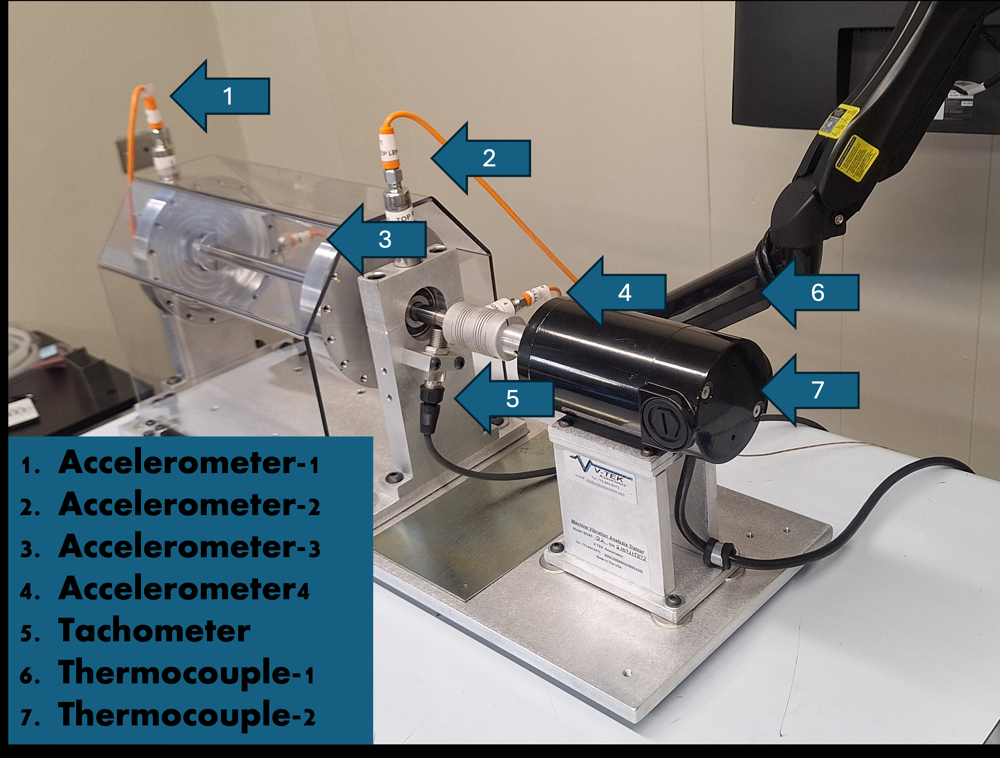

# Cutsforth InsightCM Motor Monitoring Data

## Overview

This directory contains comprehensive condition monitoring data collected from a motor test bed using **Cutsforth InsightCM** cloud-based monitoring platform. The dataset includes temperature, vibration (acceleration), and motor speed measurements captured at sub-minute intervals, providing high-resolution data for both baseline (healthy) and faulted operational states. This complements the Bently Nevada System1 dataset collected from the same equipment.

## Equipment and Monitoring Setup

*Thermocouples 3 and 4 are not part of the motor test bed and can be ignored*

- **Motor**: Test bed motor (same equipment as BentlyNevada_System1)
- **Software Platform**: Cutsforth InsightCM (cloud-based IoT monitoring)
- **Measurement Frequency**: 1-second or sub-minute intervals
- **Sensor Channels**:
  - 4 Thermocouples (temperature monitoring)
  - 4 Accelerometers (vibration monitoring)
  - 1 Tachometer (motor speed)

## Data Structure

### Directory Organization

```
Cutsforth_InsightCM/
├── final.csv                          # Processed/aggregated summary data
├── icm_chiller.json                   # Complete measurements in JSON format (~244 MB)
├── icm_chiller_split_10mb/            # Split version for Git (24 files × ~10 MB)
│   ├── icm_chiller_part001.json
│   ├── icm_chiller_part002.json
│   ├── ...
│   └── icm_chiller_part024.json
└── image/                             # Dataset images/figures
```

### File Descriptions

#### final.csv (Recommended Starting Point)

High-level aggregated and processed data suitable for rapid analysis and model prototyping.

**Format**: Time-series CSV with datetime and aggregated metrics

The JSON files contain equivalent measurement content represented as event-style records with timestamps and sensor payloads.

```
datetime,Thermocouple_1_Temperature_F,Thermocouple_2_Temperature_F,Thermocouple_3_Temperature_F,Thermocouple_4_Temperature_F,Accelerometer_1_Crest_Factor_g_g,Accelerometer_1_Derived_Peak_g,Accelerometer_1_Peak-Peak_g,Accelerometer_1_RMS_g,Accelerometer_1_True_Peak_g,Accelerometer_1_High_Frequency_g_rms,Accelerometer_2_Crest_Factor_g_g,Accelerometer_2_Derived_Peak_g,Accelerometer_2_Peak-Peak_g,Accelerometer_2_RMS_g,Accelerometer_2_True_Peak_g,Accelerometer_2_High_Frequency_g_rms,Accelerometer_3_Crest_Factor_g_g,Accelerometer_3_Derived_Peak_g,Accelerometer_3_Peak-Peak_g,Accelerometer_3_RMS_g,Accelerometer_3_True_Peak_g,Accelerometer_3_High_Frequency_g_rms,Accelerometer_4_Crest_Factor_g_g,Accelerometer_4_Derived_Peak_g,Accelerometer_4_Peak-Peak_g,Accelerometer_4_RMS_g,Accelerometer_4_True_Peak_g,Accelerometer_4_High_Frequency_g_rms,Tachometer_Speed_RPM,Tachometer_Gap_volt,status,voltage
2025-08-01 13:18:08,74.35006979878608,69.42455365189906,70.41199177631798,70.60098066234755,1.63287192113715,0.2551234928691885,0.56243896484375,0.180399551847801,0.2945693627979997,0.0082428562601824,...,741.1245709897629,,baseline,40.0
```

**Columns**:

- Timestamp (ISO 8601 format)
- 4× Temperature readings from thermocouples (°F)
- 6× Acceleration metrics per accelerometer × 4 accelerometers = 24 acceleration columns
- Tachometer speed (RPM) and gap voltage
- Status flag (operating condition label)
- Voltage (power supply voltage)

#### icm_chiller_split_10mb/ (Recommended for Git)

JSON measurements split into 10 MB chunks for Git-friendly storage and distribution. **Use these files for pushing to GitHub.**

- 24 files total (~10 MB each, last file ~2.27 MB)
- Contains 852,860 individual sensor records
- Total uncompressed: ~244 MB
- Format: JSON array of objects

**JSON Record Structure**:

```json
{
  "_id": {"$oid": "688bbfe6d51ac3664ac71d01"},
  "topic": "Equipment/Thermocouple 1",
  "payload": "{\"Temperature (F)\": 70.305}",
  "qos": 0,
  "timestamp": 1753989094,
  "datetime": "31/07/2025 15:11:34"
}
```

**Reading the Split Files**:

```python
import json
import pandas as pd

# Load all split files
records = []
for i in range(1, 25):
    filename = f'icm_chiller_split_10mb/icm_chiller_part{i:03d}.json'
    with open(filename, 'r') as f:
        records.extend(json.load(f))

# Convert to DataFrame
df = pd.DataFrame(records)
print(f"Total records: {len(df)}")
```

#### icm_chiller.json (Complete JSON Dataset)

Complete JSON export (~244 MB). Contains the same measurement content as `final.csv` in event-record form. **Note**: This file is large for typical Git operations; use the split versions instead.

## Data Characteristics

### Sensor Specifications

| Sensor Type             | Quantity | Measurement    | Unit                    |
| ----------------------- | -------- | -------------- | ----------------------- |
| **Thermocouple**  | 4        | Temperature    | °F                     |
| **Accelerometer** | 4        | Vibration      | g (gravitational units) |
| **Tachometer**    | 1        | Motor Speed    | RPM                     |
| **Power Monitor** | 1        | Supply Voltage | Volts                   |

### Acceleration Metrics (Per Accelerometer)

Each of the 4 accelerometers provides 6 derived metrics:

| Metric                       | Description                                               |
| ---------------------------- | --------------------------------------------------------- |
| **Crest Factor**       | Ratio of peak to RMS (indicates shock/impulsiveness)      |
| **Derived Peak**       | Peak envelope acceleration (high-frequency content)       |
| **Peak-Peak**          | Full range between minimum and maximum                    |
| **RMS**                | Root mean square (overall vibration energy)               |
| **True Peak**          | Actual peak considering all frequencies                   |
| **High Frequency RMS** | RMS in the high-frequency range (bearing fault indicator) |

### Temporal Coverage

- **Collection Method**: Continuous InsightCM collection exported as JSON records
- **Sampling Rate**: Sub-minute intervals (1-5 second resolution typical)
- **Total Records**: 852,860 measurements across all sensors
- **Operating States**: Multiple motor operating states indicated by recorded status labels
- **Time Range**: July 31, 2025 - August 1, 2025

### Data Organization

**JSON Dataset** - Event-style sensor records:

- One record per sensor reading
- MQTT topic-based message structure
- Individual timestamp and payload per message
- Total file size: ~244 MB uncompressed

**CSV Dataset** - Aggregated and aligned data:

- Multi-sensor readings per timestamp
- All metrics in columnar format
- Engineered features pre-calculated
- File size: ~1.1 MB (highly compressed)
- Recommended for quick prototyping

## Use Cases

### 1. Real-Time Monitoring System Development

- Build streaming analytics pipelines from IoT data
- Implement cloud-native condition monitoring dashboards
- Develop alert systems based on threshold violations
- Test MQTT message processing at scale (852K+ records)

### 2. Temperature-Vibration Correlation Analysis

- Study thermal-mechanical coupling effects
- Identify temperature lead/lag relationships with vibration
- Develop multimodal fault signatures
- Investigate thermal effects on bearing health

### 3. Multi-Axis Vibration Analysis

- Compare fault signatures across 4 measurement axes
- Identify directional vibration patterns
- Develop 3D or multi-axis fault models
- Study motor imbalance and misalignment effects

### 4. High-Resolution Time-Series Modeling

- Train LSTM/GRU networks on dense temporal data
- Develop forecasting models for temperature/vibration trends
- Create autoencoder-based anomaly detection
- Build transfer learning models from dense to sparse data

### 5. Comparative Software Analysis

- Compare InsightCM vs. Bently Nevada System1 fault signatures
- Validate sensor consistency across measurement platforms
- Study software-specific preprocessing effects
- Calibrate cross-platform predictive models

## Recommended Analysis Approaches

### Quick Start with final.csv

```python
import pandas as pd

# Load aggregated data
df = pd.read_csv('final.csv', parse_dates=['datetime'])

# Basic exploration
print(df.head())
print(df.describe())

# Filter baseline operation
baseline = df[df['status'] == 'baseline']
print(f"Baseline records: {len(baseline)}")

# Temperature statistics
print(baseline[['Thermocouple_1_Temperature_F', 'Thermocouple_2_Temperature_F']].describe())

# RMS vibration analysis
accel_cols = [col for col in df.columns if 'RMS_g' in col]
print(baseline[accel_cols].describe())
```

### Working with JSON Data

```python
import json
import pandas as pd

# Load one split file
with open('icm_chiller_split_10mb/icm_chiller_part001.json', 'r') as f:
    records = json.load(f)

# Parse JSON payloads
for record in records[:5]:
    topic = record['topic']
    payload = json.loads(record['payload'])
    timestamp = pd.to_datetime(record['datetime'], format='%d/%m/%Y %H:%M:%S')
    print(f"{timestamp} | {topic} | {payload}")
```

### Feature Engineering Suggestions

**Temperature Features**:

- Moving averages (5, 15, 30 minute windows)
- Temperature gradient (rate of change)
- Temperature variance across 4 thermocouples
- Deviation from baseline temperature

**Vibration Features**:

- Time-domain: Statistics (mean, std, skew, kurtosis) per window
- Frequency-domain: FFT components in bearing fault band (5-40 kHz typical)
- Energy ratios: High-frequency RMS / Total RMS
- Envelope analysis: Derived peak trends

**Multi-Sensor Features**:

- Temperature-vibration correlation coefficients
- Cross-axis vibration ratios
- Motor speed synchronous components
- Power consumption efficiency (voltage × apparent load)

## Data Quality and Completeness

- **State Coverage**: Multiple operating states are included and identified by `status` labels
- **High Temporal Resolution**: Dense sampling provides opportunity for time-series deep learning
- **Multi-Channel Redundancy**: 4 sensors per modality enable cross-validation
- **Realistic Noise**: Measured data includes sensor noise and quantization artifacts
- **Missing Values**: Sparse (primarily complete dataset)

## Comparison with BentlyNevada_System1

| Aspect                   | InsightCM                              | System1                        |
| ------------------------ | -------------------------------------- | ------------------------------ |
| **Format**         | JSON event records                     | Individual CSV files           |
| **Channels**       | 4 accelerometers, 4 temps              | 2 accelerometers               |
| **Metrics**        | 6 per accelerometer + temp             | 6 per channel                  |
| **Temporal**       | ~1-5 sec intervals                     | ~1 min intervals               |
| **Total Records**  | 852,860                                | ~15,000 (estimated)            |
| **File Size**      | 244 MB (JSON)                          | ~5 MB (all files)              |
| **Fault Coverage** | Multiple operating states              | Multiple fault types           |
| **Use Case**       | Real-time streaming, anomaly detection | Fault classification, trending |

## File Preparation Notes

**For Git Distribution**:

- ✅ Use `icm_chiller_split_10mb/` (24 × 10 MB JSON files)
- ✅ Include `final.csv` for quick access
- ❌ Do not commit `icm_chiller.json` (too large)

**For Local Development**:

- Start with `final.csv` for rapid iteration
- Use split JSON files for streaming/pipeline testing
- Reconstruct full dataset from splits only if necessary

## Related Files

- See `../README.md` for overall dataset documentation
- Companion dataset: `../BentlyNevada_System1/` (same motor, different monitoring software)
- Project root: `../../README.md` for full context

## References and Standards

- **MQTT Topic Structure**: Based on Equipment/`<Sensor Name>` convention
- **Acceleration Units**: g-units (9.81 m/s²)
- **Temperature Units**: Fahrenheit (°F)
- **Timestamp Format**: ISO 8601 for CSV, Unix epoch for JSON
- **InsightCM Platform**: Cutsforth cloud-based predictive maintenance system

## Version History

- **v1.0** (August 1, 2025): Data collection complete
  - 852,860 sensor records
  - Split for Git distribution (10 MB chunks)
  - Multiple operating states recorded
  - All 4 accelerometers and thermocouples functional
